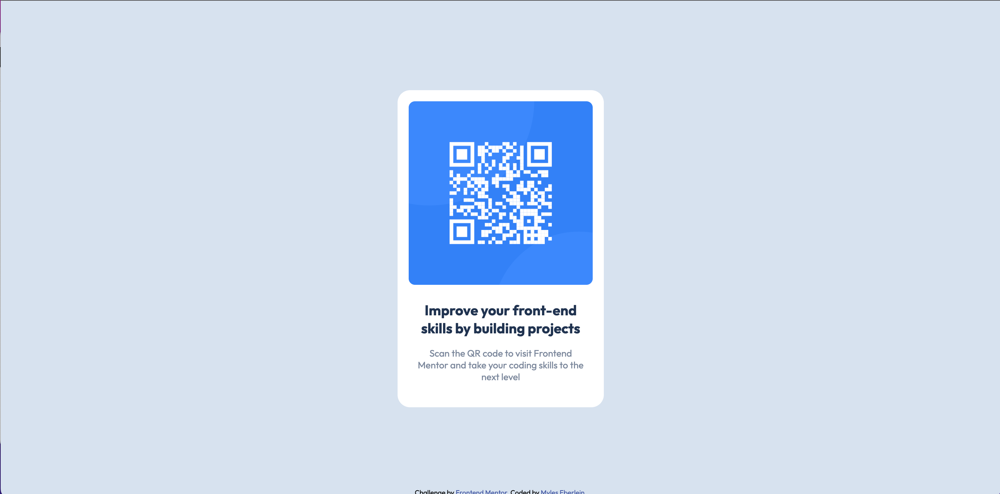

# Frontend Mentor - QR code component solution

This is a solution to the [QR code component challenge on Frontend Mentor](https://www.frontendmentor.io/challenges/qr-code-component-iux_sIO_H). Frontend Mentor challenges help you improve your coding skills by building realistic projects. 

## Table of contents

- [Overview](#overview)
  - [Screenshot](#screenshot)
  - [Links](#links)
- [My process](#my-process)
  - [Built with](#built-with)
  - [What I learned](#what-i-learned)
- [Author](#author)
- [Acknowledgments](#acknowledgments)

## Overview
Responsively created with HTML and CSS
### Screenshot

### Links
- Solution URL: [GitHub](https://github.com/myleselym/FM-qr-code-component)
- Live Site URL: [Live Demo](fm-qr-code-component-lac.vercel.app)

## My process
I really just plowed head first into this one. I will take the time to configure my css file with global variables next time to be more efficient while trying to adhere to the style guide.
### Built with
- Semantic HTML5 markup
- CSS custom properties
### What I learned

I learned how to leverage margin, padding, and min and max width to create a responsive design. 
### Continued development

This project showed me that you can do a lot with just CSS and HTML. I look forward to continuing to find elegant solutions to the next challenges.

## Author

- Website - [Myles Eberlein](https://www.linkedin.com/in/myles-eberlein-653440111/)
- Frontend Mentor - [@yourusername](https://www.frontendmentor.io/profile/myleselym)

## Acknowledgments

I would like to thank the Mr Coder youtube channel (@MrCoderYt) for some new ideas on how to leverage margin, padding, and min and max width to create this responsive design. Normally I would use flex or grid but he offered some elegant and simple solutions. I can over think things when I code, I appreciate his straight forward approach to css.
